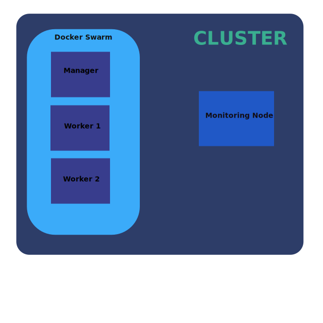

|pic1| |pic2| |pic3| |pic4|

A Simple Ansible Inventory Generator
====================================

Overview
--------
This simple library makes it easier to write *glue* code between infrastructure bringup/deployment and software provisioning stages of a one-click deployment.

Installation
------------
Simply say:

.. code::

   pip install ansinv
   
Make sure you are using correct pip (pip/pip3) depending on your Python environment.

Use Case
--------
Picture the following Docker Swarm cluster that needs to be brought up and provisioned all in one go. The infrastructure has one manager, two workers, and a cluster heath monitoring node.

|pic5|

Automation Steps
----------------
Let's say you are using `Terraform <https://www.terraform.io/>`_ tool to bringup cluster on AWS and using `Ansible <https://docs.ansible.com/ansible/latest/index.html>`_ for software provisioning. Following can be the basic steps:

#. Invoke Terraform with desired configuration. After finishing, terraform provides with a `terraform state <https://www.terraform.io/docs/state/index.html>`_ file. 
#. Use information (like host IP addresses) from this *terraform.tfstate* file to generate an `inventory <https://docs.ansible.com/ansible/latest/user_guide/intro_inventory.html>`_ file to be given to Ansible in the next step.
#. Invoke Ansible `plays <https://docs.ansible.com/ansible/latest/user_guide/playbooks.html>`_ with the inventory file from above step to configure software on the infrastrucure.
#. Cluster is ready to use :)

Generating the Inventory file
-----------------------------
How are we going to generate inventory file in step #2 above? Options:

#. Creating manually by looking at the terraform state file and hand-editing the inventory file. It works! but not inline with one-click deployment philosophy.
#. Writing code to parse the terraform state file for required information and generating inventory file on the fly. This is where *ansinv* can help.

While writing code to parse terraform state file and generating the the inventory file in INI format, we have to write quite a bit of boiler-plate code which doesn't change from one deployment to another. For example: generating inventory file's INI template, dealing with hosts, groups and their inter-relation, adding hostvars and groupvars at proper place in the inventory file etc. Here *ansinv* comes to the rescue and wraps all that common functionality into a nice and easy to use API.

A Code Example
--------------
If you browse the *example* directory, you will find *example/generate_inventory.py* python file. This file reads *example/terraform.tfstate.example* and generates inventory file similar to *example/inventory.example*. FYI, the ordering of sections in the inventory file can be different every time you generate it. But this doesn't matter.

.. |pic1| image:: https://img.shields.io/badge/License-MIT-yellow.svg
            :target: https://opensource.org/licenses/MIT

.. |pic2| image:: https://badge.fury.io/py/ansinv.svg
            :target: https://pypi.org/project/ansinv

.. |pic3| image:: https://travis-ci.com/rsjethani/ansinv.svg?branch=master
            :target: https://travis-ci.com/rsjethani/ansinv

.. |pic4| image:: https://codecov.io/gh/rsjethani/ansinv/branch/master/graph/badge.svg
            :target: https://codecov.io/gh/rsjethani/ansinv

